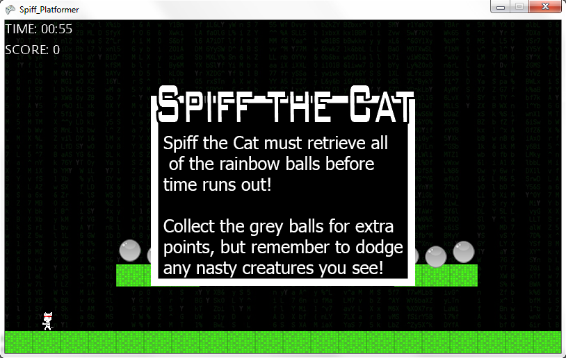

Spiff-VS
========
Andrea Sassu, Eric Lobato, Cliff Min  
CSCI 4448 
Hughes & Boese 
Spring 2014 
 
##Description
Spiff Platformer created using Visual Studio with C# and XNA. 
 
##References
Jumping reference: 
http://flatformer.blogspot.com/2010/02/making-character-jump-in-xnac-basic.html 
Microsoft Developer Network Platformer Starter Kit: 
http://msdn.microsoft.com/en-us/library/dd254918%28v=xnagamestudio.31%29.aspx 
##Resources
Tiles base: 
http://opengameart.org/content/tile 
Player & Enemy Sprites 
http://opengameart.org/users/dogchicken 
Orbs base: 
http://opengameart.org/content/orbs-wo-drop-shadows 
Sounds: 
<ul>
<li><a href="https://www.freesound.org/people/Department64/sounds/64015/">Cat Death Sound</a></li>
<li><a href="https://www.freesound.org/people/bradwesson/sounds/135936/">Coin Collect Sound</a></li>
<li><a href="https://www.freesound.org/people/Hitrison/sounds/216675/">Jump Sound</a></li>
<li><a href="https://www.freesound.org/people/ani_music/sounds/233603/">End Level Sound</a></li>
</ul>
##Screenshots
 
 